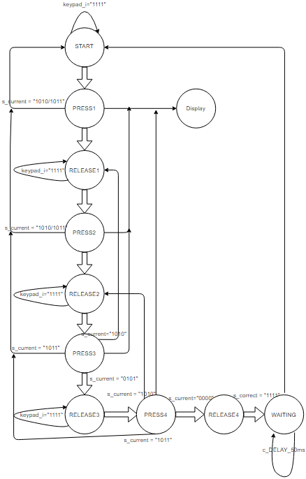
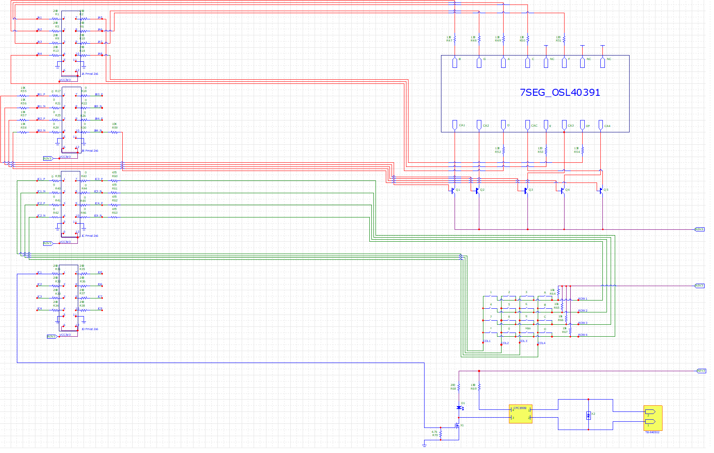
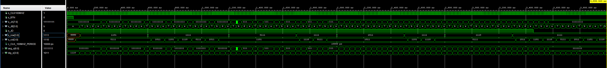
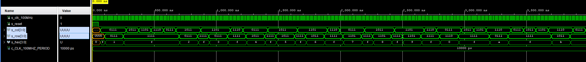

# Digital-electronics-1-Project

## Team members: 
Nanko     Matej <br>
Nikolic   Predrag <br>
Ondriš    Mário <br>
Opluštil  Filip <br>
Pijáček   Štěpán <br>

[Our project folder](https://github.com/xnanko00/Digital-electronics-1-Project)

## Project objectives:
In this project we are supposed to make a program in VHDL for door lock system with PIN (4-digit) terminal, 4x3 push buttons, 4-digit 7-segment display, relay for door lock control. As an extra feature we also added delete/reset button that resets keyboard sequence.

### Diagram



## Hardware description 

### Board schematic of our project(for higher resolution you need to open it in microcap [here](https://github.com/xnanko00/Digital-electronics-1-Project/circuit)):



## VHDL modules description 

### Keyboard
We programmed our keyboard to ...

### VHDL lock:
```vhdl
library IEEE;
use IEEE.STD_LOGIC_1164.ALL;
use IEEE.NUMERIC_STD.ALL;

-- Uncomment the following library declaration if using
-- arithmetic functions with Signed or Unsigned values
--use IEEE.NUMERIC_STD.ALL;

-- Uncomment the following library declaration if instantiating
-- any Xilinx leaf cells in this code.
--library UNISIM;
--use UNISIM.VComponents.all;

entity lock is
    port(
        clk     : in  std_logic;
        reset   : in  std_logic;
        keypad_i: in std_logic_vector(4 - 1 downto 0);
        data0_o : out  std_logic_vector(4 - 1 downto 0);
        data1_o : out  std_logic_vector(4 - 1 downto 0);
        data2_o : out  std_logic_vector(4 - 1 downto 0);
        data3_o : out  std_logic_vector(4 - 1 downto 0);
        door_o  : out  std_logic

    );
end lock;

architecture Behavioral of lock is

    -- Define the states
    type t_state is (START,
                     PRESS1,
                     RELEASE1,
                     PRESS2,
                     RELEASE2,
                     PRESS3,
                     RELEASE3,
                     PRESS4,
                     RELEASE4,
                     WAITING
                     );
    -- Define the signal that uses different states
    signal s_state  : t_state;

    -- Internal clock enable
    signal s_en     : std_logic;
    -- Local delay counter
    signal s_cnt    : unsigned(5 - 1 downto 0);
    
    signal   s_col      : STD_LOGIC_VECTOR (4 - 1 downto 0);
    signal   s_current  : STD_LOGIC_VECTOR(4 - 1 downto 0);

    signal   s_correct  : STD_LOGIC_VECTOR(4 - 1 downto 0);
    signal   r_data0    : STD_LOGIC_VECTOR(4 - 1 downto 0);
    signal   r_data1    : STD_LOGIC_VECTOR(4 - 1 downto 0);
    signal   r_data2    : STD_LOGIC_VECTOR(4 - 1 downto 0);
    signal   r_data3    : STD_LOGIC_VECTOR(4 - 1 downto 0);
    signal   r_door     : std_logic;

    -- Specific values for local counter
    constant c_DELAY : unsigned(5 - 1 downto 0)         := b"1_0000";
    constant c_ZERO       : STD_LOGIC_VECTOR(4 - 1 downto 0) := b"1111";

begin
    clk_en0 : entity work.clock_enable
        generic map(
            g_MAX => 10       -- g_MAX = 10 ms / (1/100 MHz) 
        )
        port map(
            clk   => clk,
            reset => reset,
            ce_o  => s_en
        );
    p_lock : process(clk)
    variable   s_display  : STD_LOGIC_VECTOR(4 - 1 downto 0);
    variable   s_door     : std_logic;
    
    begin
        if rising_edge(clk) then
        s_door := r_door;
            if (reset = '1') then       -- Synchronous reset
                s_state <= START ;      -- Set initial state
                s_door := '1';
                s_current <= "1111";
                s_display := "0000";
                
            elsif (s_en = '1') then
                case s_state is
                
                    when START =>
                        if (keypad_i = "1111" or keypad_i = "1010" or  keypad_i = "1011") then
                            s_current   <= c_ZERO;
                        else
                            s_state <= PRESS1;
                            s_current <= keypad_i;
                            s_display := keypad_i;
                        end if;

                    when PRESS1 =>
                        if (s_current = keypad_i) then
                            s_display := s_current;
                        else
                            if (s_current = "0111") then  --7
                                s_correct(0) <= '1';
                                s_state <= RELEASE1;
                                s_current   <= c_ZERO;
                            elsif (s_current = "1010") then     --goto start if you press A
                                s_state <= START;
                                s_correct <= "0000";
                            elsif (s_current = "1011") then     --goto start if you press B
                                s_state <= START;
                                s_correct <= "0000";
                            else
                                s_state <= RELEASE1;
                                s_current   <= c_ZERO;
                            end if;
                        end if;
                        
                    when RELEASE1 =>
                        if (keypad_i = "1111") then  
                            s_current   <= c_ZERO;
                        else
                            s_state <= PRESS2;
                            s_current <= keypad_i;
                            s_display := keypad_i;
                        end if;
                        
                    when PRESS2 =>
                        if (s_current = keypad_i) then
                            s_display := s_current;
                        else
                            if (s_current = "0011") then    --3
                                s_correct(1) <= '1';
                                s_state <= RELEASE2;
                                s_current   <= c_ZERO;
                            elsif (s_current = "1010") then
                                s_state <= START;
                                s_correct(0) <= '0';
                            elsif (s_current = "1011") then
                                s_state <= START;
                                s_correct <= "0000";
                            else
                                s_state <= RELEASE2;
                                s_current   <= c_ZERO;
                            end if;
                        end if;
                        
                    when RELEASE2 =>
                        if (keypad_i = "1111") then
                            s_current   <= c_ZERO;
                        else
                            s_state <= PRESS3;
                            s_current <= keypad_i;
                            s_display := keypad_i;
                        end if;
                        
                    when PRESS3 =>
                        if (s_current = keypad_i) then
                            s_display := s_current;
                        else
                            if (s_current = "0101") then    --5
                                s_correct(2) <= '1';
                                s_state <= RELEASE3;
                                s_current   <= c_ZERO;
                            elsif (s_current = "1010") then -- To be honest I dont know how does this work.
                                r_data2 <= c_ZERO;          -- I thought that it will skip 2nd display and
                                s_state <= RELEASE1;        -- goto 3rd but and "it just works". It will
                                s_correct(1) <= '0';        -- wait for 2nd press and show it on display
                            elsif (s_current = "1011") then
                                s_state <= START;
                                s_correct <= "0000";
                            else
                                s_state <= RELEASE3;
                                s_current   <= c_ZERO;
                            end if;
                        end if;
                        
                    when RELEASE3 =>
                        if (keypad_i = "1111") then
                            s_current   <= c_ZERO;
                        else
                            s_state <= PRESS4;
                            s_current <= keypad_i;
                            s_display := keypad_i;
                        end if;
                        
                    when PRESS4 =>
                        if (s_current = keypad_i) then
                            s_display := s_current;
                        else
                            if (s_current = "0000") then    --0
                                s_correct(3) <= '1';
                                s_state <= RELEASE4;
                                s_current   <= c_ZERO;
                            elsif (s_current = "1010") then
                                r_data1 <= c_ZERO;
                                s_state <= RELEASE2;
                                s_correct(2) <= '0';
                            elsif (s_current = "1011") then
                                s_state <= START;
                                s_correct <= "0000";
                            end if;
                        end if;
                        
                    when RELEASE4 =>
                        if (s_correct = "1111") then
                            if (s_door = '1') then
                                s_door := '0';
                                else
                                s_door := '1';
                                end if;
                        else
                        end if;
                        s_correct <= "0000";
                        s_state <= WAITING;
                    when WAITING =>
                        if(s_cnt < c_DELAY) then
                            s_cnt <= s_cnt + 1;
                        else
                            s_state <= START;
                            s_correct <= "0000";
                            s_display := "1111";
                            s_state <= START;
                            end if;    

                    -- It is a good programming practice to use the 
                    -- OTHERS clause, even if all CASE choices have 
                    -- been made. 
                    when others =>
                        s_state <= START;

                end case;
            end if; -- Synchronous reset


        case s_state is
            when PRESS1 =>
                if(s_display = "1010" or s_display = "1011") then
                    r_data3 <= c_ZERO;
                else
                    r_data3 <= s_display;
                end if;
            when PRESS2 =>
                if(s_display = "1010" or s_display = "1011") then
                    r_data3 <= c_ZERO;
                    r_data2 <= c_ZERO;
                else
                    r_data2 <= s_display;
                end if;
            when PRESS3 =>
                if(s_display = "1010") then
                    r_data2 <= c_ZERO;
                elsif(s_display = "1011") then
                    r_data3 <= c_ZERO;
                    r_data2 <= c_ZERO;
                else
                    r_data1 <= s_display;
                end if;
            when PRESS4 =>
                if(s_display = "1010") then
                    r_data1 <= c_ZERO;
                elsif(s_display = "1011") then
                    r_data3 <= c_ZERO;
                    r_data2 <= c_ZERO;
                    r_data1 <= c_ZERO;
                else
                    r_data0 <= s_display;
                end if;
            when START =>
                r_data0 <= c_ZERO;
                r_data1 <= c_ZERO;
                r_data2 <= c_ZERO;
                r_data3 <= c_ZERO;
            when others =>
                

        end case;
        end if; -- Rising edge
        r_door <= s_door;
        end process p_lock;
        data0_o <= r_data0; --register to display outputs
        data1_o <= r_data1;
        data2_o <= r_data2;
        data3_o <= r_data3;
        door_o  <= r_door;  --register for relay to output
        
end Behavioral;
```
### VHDL keypad:
```vhdl
library IEEE;
use IEEE.STD_LOGIC_1164.ALL;
use IEEE.NUMERIC_STD.ALL;

-- Uncomment the following library declaration if using
-- arithmetic functions with Signed or Unsigned values
--use IEEE.NUMERIC_STD.ALL;

-- Uncomment the following library declaration if instantiating
-- any Xilinx leaf cells in this code.
--library UNISIM;
--use UNISIM.VComponents.all;

entity keypad is
Port 
    (
    clk     : in  std_logic;
    reset   : in  std_logic;
    col_o   : out STD_LOGIC_VECTOR (4 - 1 downto 0);
    row_i   : in STD_LOGIC_VECTOR (4 - 1 downto 0);
    hex_o   : out STD_LOGIC_VECTOR (4 - 1 downto 0)
    );
end keypad;

architecture Behavioral of keypad is

    type t_state is (COL_1,  --(1 4 7 0)
                     COL_2,  --(2 5 8 F)
                     COL_3,  --(3 6 9 E)
                     COL_4   --(A B C D)
                     );
                     
    signal s_state  : t_state;
    signal s_en     : std_logic;
    signal s_cnt    : unsigned(5 - 1 downto 0);
    signal r_hex: STD_LOGIC_VECTOR (4 - 1 downto 0);
    
    constant c_DELAY_50ms : unsigned(5 - 1 downto 0) := b"0_1001";
    constant c_ZERO       : unsigned(5 - 1 downto 0) := b"0_0000";
begin

    clk_en0 : entity work.clock_enable
        generic map(
            g_MAX => 1--000000       -- g_MAX = 10 ms / (1/100 MHz) 
        )
        port map(
            clk   => clk,
            reset => reset,
            ce_o  => s_en
        );
    p_keypad_timer : process(clk)
    variable s_hex: STD_LOGIC_VECTOR (4 - 1 downto 0);
    begin
        if rising_edge (clk) then
        s_hex :=r_hex;
            if (reset = '1') then       -- Synchronous reset
                s_state <= COL_1;      -- Set initial state
                s_cnt <= c_ZERO;
                
            elsif (s_en = '1') then
                case s_state is
                     when COL_1 =>
                        if(s_cnt < c_DELAY_50ms) then   --change collum every 50 ms 
                            s_cnt <= s_cnt + 1;
                        else
                            if (s_hex = "1111") then    --wait if there is output to lock
                                s_state <= COL_2;
                                s_cnt <= c_ZERO;
                            else
                                s_state <= COL_1;       --if yes go wait in this step
                            end if;
                        end if;
                     when COL_2 =>
                        if(s_cnt < c_DELAY_50ms) then
                            s_cnt <= s_cnt + 1;
                        else
                            if (s_hex = "1111") then
                                s_state <= COL_3;
                                s_cnt <= c_ZERO;
                            else
                                s_state <= COL_2;
                            end if;
                        end if;
                     when COL_3 =>
                        if(s_cnt < c_DELAY_50ms) then
                            s_cnt <= s_cnt + 1;
                        else
                            if (s_hex = "1111") then
                                s_state <= COL_4;
                                s_cnt <= c_ZERO;
                            else
                                s_state <= COL_3;
                            end if;
                        end if;
                     when COL_4 =>
                        if(s_cnt < c_DELAY_50ms) then
                            s_cnt <= s_cnt + 1;
                        else
                            if (s_hex = "1111") then
                                s_state <= COL_1;
                                s_cnt <= c_ZERO;
                            else
                                s_state <= COL_4;
                            end if;
                        end if;
                end case; 

                case s_state is
                     when COL_1 =>
                        col_o <= "0111";            --collum signal
                        if(row_i ="0111") then      --setting row input with keypad
                            s_hex := "0001";    --1
                        elsif(row_i ="1011") then
                            s_hex := "0100";    --4
                        elsif(row_i ="1101") then
                            s_hex := "0111";    --7
                        elsif(row_i ="1110") then
                            s_hex := "0000";    --0
                        else
                            s_hex := "1111";
                        end if;
                     when COL_2 =>
                        col_o <= "1011";
                        if(row_i ="0111") then
                            s_hex := "0010";    --2
                        elsif(row_i ="1011") then
                            s_hex := "0101";    --5
                        elsif(row_i ="1101") then
                            s_hex := "1000";    --8
--                        elsif(row_i ="1110") then
--                            s_hex := "1111";    --F
                        else
                            s_hex := "1111";
                        end if;
                     when COL_3 =>
                        col_o <= "1101";
                        if(row_i ="0111") then
                            s_hex := "0011";    --3
                        elsif(row_i ="1011") then
                            s_hex := "0110";    --6
                        elsif(row_i ="1101") then
                            s_hex := "1001";    --9
--                        elsif(row_i ="1110") then
--                            s_hex := "1110";    --E we are not using this
                        else
                            s_hex := "1111";
                        end if;
                     when COL_4 =>
                        col_o <= "1110";
                        if(row_i ="0111") then
                            s_hex := "1010";    --A (deleting of previous character)
                        elsif(row_i ="1011") then
                            s_hex := "1011";    --B (delete everything)
--                        elsif(row_i ="1101") then
--                            s_hex := "1100";    --C we are not using this
--                        elsif(row_i ="1110") then
--                            s_hex := "1101";    --D we are not using this
                        else
                            s_hex := "1111";
                        end if;
        
                end case; 
            end if;
        end if;
    r_hex <= s_hex;
    end process p_keypad_timer;
    hex_o <= r_hex;     --register to hex output
end Behavioral;
```

## TOP module description and simulations

### Simulation of a top:


### Simulation of a keypad:


### Simulation of a lock:


## Video
TODO

## References 

https://reference.digilentinc.com/_media/reference/programmable-logic/arty-a7/arty_a7_sch.pdf <br>
https://reference.digilentinc.com/_media/reference/pmod/pmodkypd/pmodkypd_sch.pdf <br>
http://fpga.fm4dd.com/?pmod/7seg4 <br>
https://store.digilentinc.com/arty-a7-artix-7-fpga-development-board/ <br>
https://store.digilentinc.com/pmod-ssr-solid-state-relay-electronic-switch/ <br>
https://store.digilentinc.com/pmod-kypd-16-button-keypad/ <br>
